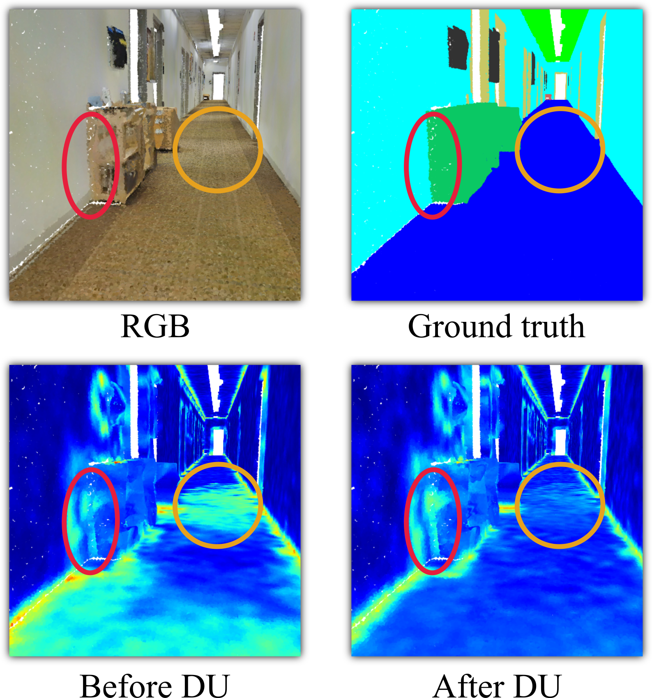

# Interpretable Edge Enhancement and Suppression Learning for 3D Point Cloud Segmentation
Created by: Haoyi Xiu, Xin Liu, Weimin Wang, Kyoung-Sook Kim, Takayuki Shinohara, Qiong Chang, and Masashi Matsuoka

<!--  -->

Our code is released under MIT License (see LICENSE file for details).
<\p>
